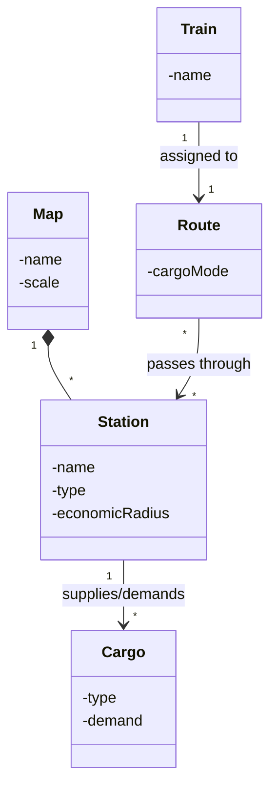

# All Aboard - Railway Network Simulator

**Academic Context:** 2nd Semester Integrative Project (BSc Software Engineering - ISEP). Developed in a team of 5 students.

***Note:** The source code is held in a private repository due to the institution's academic integrity policies. This repository documents the architecture and the technical solution developed.*

### The Business Problem
Development of a comprehensive IT solution to simulate the operation of a railway network, inspired by classic management games like Railroad Tycoon. The system features a map/scenario editor and a simulation engine to manage trains, stations, supply/demand of cargoes, and financial performance.

### Tech Stack
*   **Core & UI:** Java, JavaFX 11
*   **Data Analysis:** Python, Jupyter Notebook
*   **Testing & Quality:** JUnit 5, JaCoCo, TDD
*   **Algorithms & Graphs:** Custom Graph implementations, GraphStream/Graphviz

### Technical Solution & Architecture

The project integrated software engineering best practices, advanced data structures, and statistical analysis:

*   **Software Engineering:** Built with Object-Oriented Programming (OOP) principles in Java using Test-Driven Development (TDD). The graphical interface was developed in JavaFX 11, and object serialization was used for data persistence.
*   **Graph Algorithms & Complexity:** Implemented custom graph data structures (without external math libraries) to analyze network connectivity, find shortest paths between stations, and calculate track maintenance routes. Included rigorous worst-case time complexity analysis (Big-O) for all algorithms.
*   **Data Science & Statistics:** Utilized Python and Jupyter Notebooks to compute Key Performance Indicators (KPIs), generate histograms and boxplots for cargo/passenger traffic, and apply linear regression models to forecast station revenues based on demand and offer dynamics.

### Domain Model (Excerpt)

### Team
Developed in collaboration with João Ferreira, Susana Loureiro, Rafael Capão and José Cardoso.
